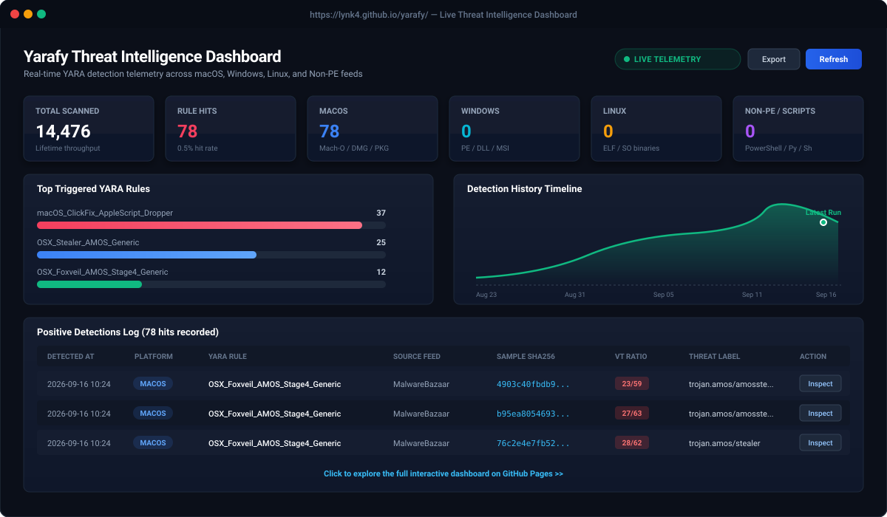

# Yarafy

[](https://lynk4.github.io/yarafy/)
[](https://lynk4.github.io/yarafy/)
[](https://lynk4.github.io/yarafy/)
[](https://lynk4.github.io/yarafy/)
[](https://virustotal.github.io/yara/)

**Yarafy** is an automated YARA rule management, threat hunting, and telemetry visualization pipeline. It enables security researchers and threat hunters to store YARA rules across **macOS**, **Windows**, **Linux**, and **Non-PE / Script** platforms, hunt against live malware feeds from **MalwareBazaar**, enrich positive detections using **VirusTotal**, record continuous detection telemetry, and explore insights through an interactive cyber dashboard.

---

## Live Threat Intelligence Dashboard

<p align="center">
  <a href="https://lynk4.github.io/yarafy/">
    
  </a>
</p>

<p align="center">
  <b><a href="https://lynk4.github.io/yarafy/">Open Live Interactive Telemetry Dashboard &rarr;</a></b>
</p>

- **Live URL:** [https://lynk4.github.io/yarafy/](https://lynk4.github.io/yarafy/)
- **Real-Time Throughput:** Over 14,000+ candidate malware samples evaluated across feeds.
- **Automated Deployment:** Automatically updated and published to GitHub Pages upon completion of any hunt workflow.
- **Deep Inspection Drawer:** Click **Inspect** on any detection to view matched YARA string variable identifiers, exact file byte offsets (e.g. `[0x18] $setup_id: ...`), binary signatures, and VirusTotal multi-engine Antivirus detection ratios.
- **Telemetry Export:** One-click JSON and CSV export of filtered detections.

---

## Repository Structure

```text
yarafy/
├── assets/                       # Visual assets & dashboard preview
│   └── dashboard_preview.svg     # Dashboard UI preview mockup
├── yara-rules/                   # YARA Rules Repository
│   ├── macos/                    # macOS rules (Mach-O, DMG, PKG, Plists, scripts)
│   ├── windows/                  # Windows rules (PE, DLL, .NET, MSI)
│   ├── linux/                    # Linux rules (ELF binaries, shared libraries)
│   └── non-pe/                   # Scripts (PowerShell, Python, Bash, VBS)
├── dashboard/                    # Interactive Visual Dashboard
│   ├── index.html                # Single-page SOC analytics dashboard
│   └── data.js                   # Pre-compiled offline telemetry data
├── telemetry/                    # Telemetry and Hit Logs
│   ├── hits.json                 # Historical match database (deduplicated)
│   ├── stats.json                # Aggregate metrics & detection counts
│   └── LATEST_REPORT.md          # Generated markdown summary
├── src/                          # Core Engine
│   ├── collector.py              # MalwareBazaar API client & platform type filter
│   ├── scanner.py                # YARA compiler, multi-file scanner & offset extractor
│   ├── enricher.py               # VirusTotal API v3 enricher (free tier compliant)
│   ├── reporter.py               # Telemetry aggregator & in-place score refresher
│   ├── config.py                 # Configuration manager
│   └── main.py                   # CLI entrypoint
├── .github/workflows/
│   ├── hunt_bazaar_macos.yml     # Manual macOS feed hunting workflow
│   ├── hunt_bazaar_windows.yml   # Manual Windows feed hunting workflow
│   ├── hunt_bazaar_linux.yml     # Manual Linux feed hunting workflow
│   ├── hunt_bazaar_non_pe.yml    # Manual Script / Non-PE feed hunting workflow
│   ├── hunt_bazaar_all.yml       # Manual Multi-Platform feed hunting workflow
│   ├── refresh_vt_scores.yml     # Re-check historical hits against VirusTotal
│   ├── deploy_dashboard.yml      # Automatic GitHub Pages deployment workflow
│   └── yara_lint.yml             # CI syntax testing on pull requests / commits
├── config.yaml                   # Hunting settings & platform configurations
├── requirements.txt              # Dependencies
└── .env.example                  # API Key template
```

---

## Quickstart

### 1. Installation

```bash
# Create and activate virtual environment
python3 -m venv venv
source venv/bin/activate

# Install dependencies
pip install -r requirements.txt
```

### 2. Configure API Keys

Copy `.env.example` to `.env`:
```bash
cp .env.example .env
```
Fill in your API keys:
- `MALWAREBAZAAR_API_KEY`: Obtain free from [MalwareBazaar](https://bazaar.abuse.ch/api/) for sample downloads.
- `VT_API_KEY`: Free [VirusTotal API Key](https://www.virustotal.com/gui/my-apikey) for routine hash lookup and enrichment when hits are detected.
- `ALERT_WEBHOOK_URL`: (Optional) Discord or Slack webhook URL to receive notifications on hits.

---

## Interactive Telemetry Dashboard

### 1. View Live on GitHub Pages
Your dashboard is hosted live without running anything locally:

- **Live Dashboard URL**: `https://lynk4.github.io/yarafy/`

> [!NOTE]
> The dashboard deploys automatically via GitHub Actions whenever a hunting workflow finishes or telemetry is updated.

### 2. Launch Locally from Terminal
Run the local visual dashboard in your default browser:

```bash
python -m src.main dashboard
```

- Accessible locally at: `http://localhost:8080/dashboard/`
- **Metrics**: Total scanned throughput, positive detections, hit rates, and platform breakdown.
- **Visualizations**: Detections by Platform, Source Feed comparison, Top YARA Rules, and Detection History Timeline.
- **Filters**: Platform tabs (macOS, Windows, Linux, Non-PE), Feed filters, and live keyword search.
- **Inspection Drawer**: View matched YARA strings, hex offsets, hashes, and Antivirus engine detection labels.
- **Exporting**: Export filtered telemetry to JSON or CSV with one click.

---

## CLI Commands

### 1. Validate & Lint Rules
Validates that all rules in `yara-rules/` compile without syntax errors:
```bash
python -m src.main lint
```

### 2. Run Targeted MalwareBazaar Feed Hunt
Search and download samples by specific platform, tags, file types, or family signatures:
```bash
# macOS Hunt: Target AMOS & ClickFix Mach-O samples
python -m src.main hunt --platform macos --tags "AMOS,ClickFix,AtomicStealer" --file-type macho --limit 25

# Windows Hunt: Target Lumma & RedLine PE executables
python -m src.main hunt --platform windows --tags "Lumma,RedLine,Stealer" --file-type exe --limit 25

# Linux Hunt: Target Mirai & Kinsing ELF binaries
python -m src.main hunt --platform linux --tags "Mirai,Kinsing,Linux" --file-type elf --limit 25

# Non-PE / Scripts Hunt: Target PowerShell & Python payloads
python -m src.main hunt --platform non-pe --tags "PowerShell,Python,script" --file-type script --limit 25

# Multi-Platform Hunt: Run across all active platforms with config defaults
python -m src.main hunt --platform all --limit 25
```

### 3. Scan Local Files or Directories
Test your rules against local suspicious files or test folders:

```bash
# Terminal output only (inspect matches, strings, and hex offsets):
python -m src.main scan-local /path/to/sample

# Filter by platform rules (e.g. macOS only):
python -m src.main scan-local /path/to/sample --platform macos

# Scan an entire directory recursively:
python -m src.main scan-local /path/to/samples_folder/

# Test AND record positive hits to telemetry database & dashboard:
python -m src.main scan-local /path/to/sample --record
```

### 4. Refresh Historical VirusTotal Scores
Re-queries VirusTotal for past hits to update their AV detection scores and threat labels:
```bash
# Refresh samples with 0 detections or unverified statuses
python -m src.main refresh-vt --mode zero-only --limit 20

# Refresh all historical samples
python -m src.main refresh-vt --mode all --limit 20
```

### 5. Launch Telemetry Dashboard Locally
```bash
python -m src.main dashboard
```

### 6. View Telemetry Stats in Terminal
```bash
python -m src.main stats
```

---

## GitHub Actions Workflows

All hunting workflows are strictly manual (`workflow_dispatch`) with zero scheduled auto-runs:

| Workflow | Type | Description |
| :--- | :--- | :--- |
| **MalwareBazaar Hunt - macOS** | Manual | Targeted macOS search with tag, file type, and limit inputs. |
| **MalwareBazaar Hunt - Windows** | Manual | Targeted Windows search with tag, file type, and limit inputs. |
| **MalwareBazaar Hunt - Linux** | Manual | Targeted Linux search with tag, file type, and limit inputs. |
| **MalwareBazaar Hunt - Non-PE & Scripts** | Manual | Targeted script/non-PE search with tag, file type, and limit inputs. |
| **MalwareBazaar Hunt - All Platforms** | Manual | Executes hunting across all active platforms simultaneously. |
| **Refresh VirusTotal Scores** | Manual | Re-checks past hits on VT to update AV scores and threat labels. |
| **Deploy Dashboard to GitHub Pages** | Automated / Manual | Automatically builds and deploys the dashboard upon workflow completion. |
| **YARA Rule Lint & Test** | CI (Push/PR) | Validates rule syntax before code is merged. |
